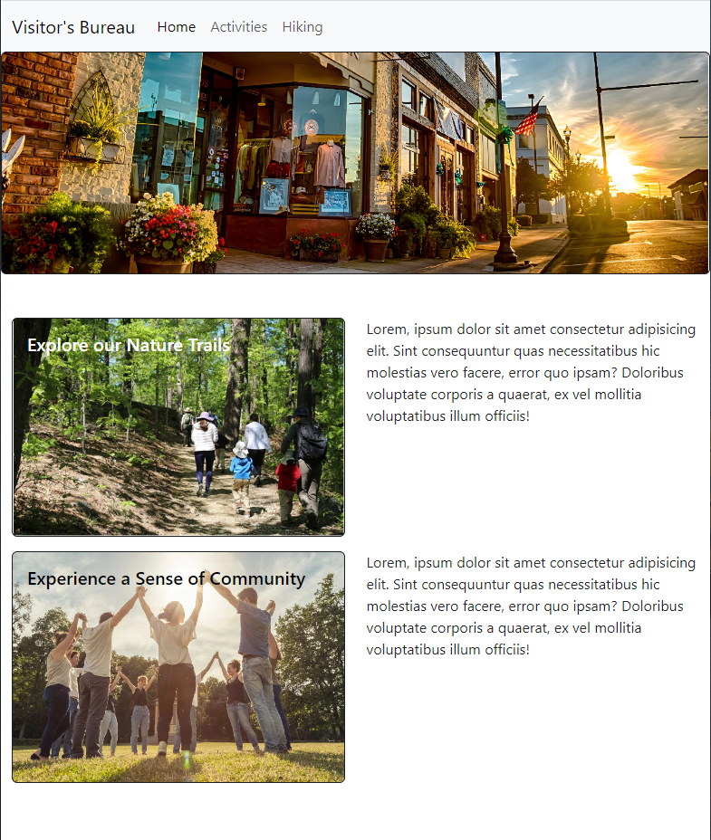
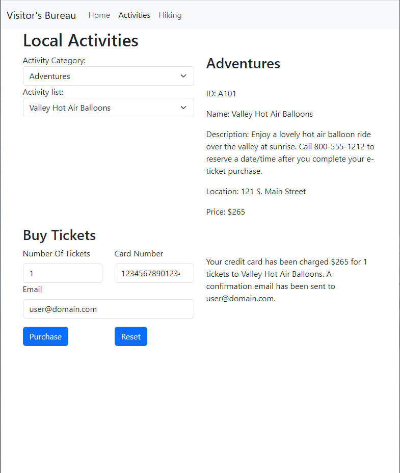
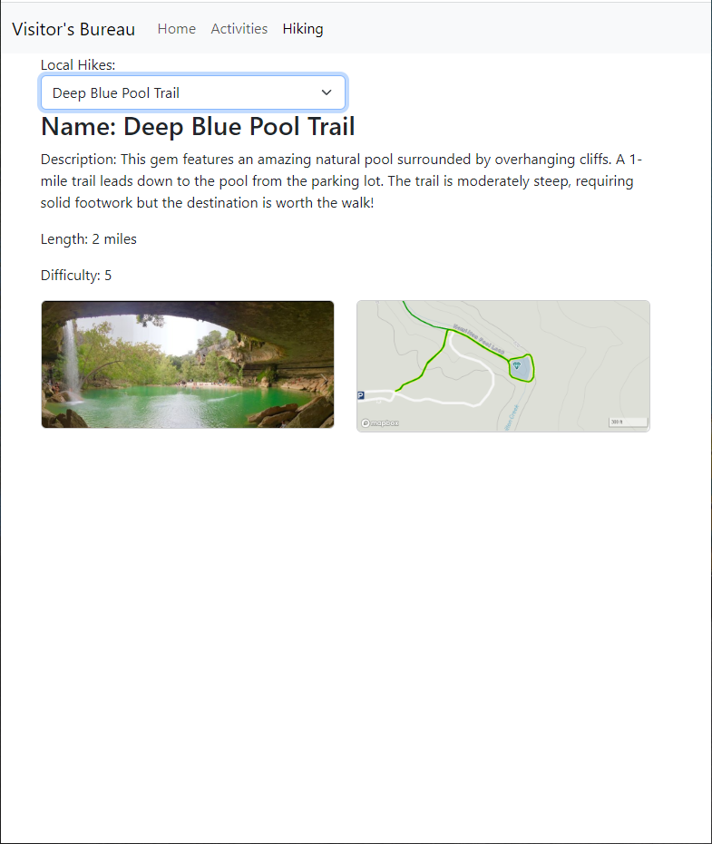

# TouristBureau

Website for a fictional Tourist Bureau.

# Page Images

## Activities Form

The form fist loads the category options from the provided categories array. When the user selects a desired category JS is used to populate a second dropdown with corresponding activity names. Once an activity is selected information about the activity is displayed. If the price is above $0 a form to buy tickets is displayed. Once the form is submitted a message appears notifying the user that the purchase was completed. If the user changes a previous selection certain forms/messages are reset (to prevent displaying incorrect information).

## Hiking Form

This form uses JS to poplulate a dropdown with names from a provided hike array. Once the user selects a hike relevant information is displayed below, as well as an image and a trail map.
